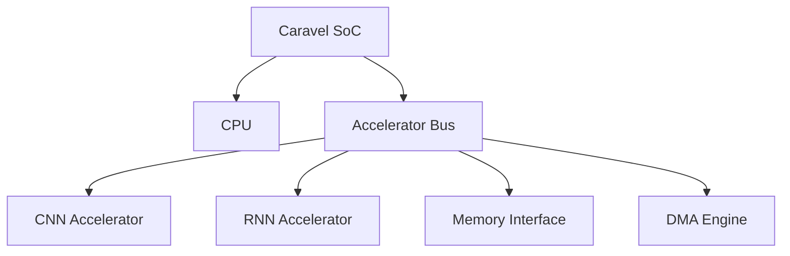

# AI-Wake-Up-Call-Submission
The challenge aims to leverage generative AI to develop an open-source hardware accelerator designed explicitly for Keyword Spotting (KWS) applications on the Caravel System-on-Chip.

# KWS Accelerator for IoT

## Abstract

This project proposes the development of an innovative hardware accelerator for Keyword Spotting (KWS) using the Caravel System-on-Chip using generative AI. This open-source KWS Accelerator targets enhanced real-time audio monitoring capabilities in Internet of Things (IoT) applications. The accelerator is specifically architected to interface seamlessly with an AWS Lambda application operating within a Linux environment. The primary function of this system is to detect and analyze keywords in audio streams emanating from linux platform. Upon detection, the KWS Accelerator evaluates the contextual significance of the keywords using advanced cloud-based sentiment analysis. Based on this analysis, the system dynamically updates its keyword detection parameters to optimize performance and accuracy with instructions from the cloud. This design not only improves responsiveness in real-time environments but also leverages cloud computing resources to adapt to evolving audio contexts, thereby enhancing the overall efficiency and utility of the IoT ecosystem with a custom KWS Accelerator.

## Project Overview

This project introduces a groundbreaking hardware accelerator for Keyword Spotting (KWS) integrated within the Caravel System-on-Chip. It is designed to boost real-time audio monitoring capabilities for Internet of Things (IoT) applications. The accelerator leverages generative AI to provide advanced detection and analysis of keywords in audio streams from a Linux platform.

## Features

- Real-Time Audio Monitoring: Enhances responsiveness and accuracy in IoT devices.
- Cloud-Based Sentiment Analysis: Evaluates the contextual significance of detected keywords using advanced cloud computing resources.
- Dynamic Parameter Updates: Optimizes keyword detection parameters dynamically based on cloud instructions to adapt to evolving audio contexts.

## System Requirements

- Linux operating environment
- AWS Lambda application

## Accelerator Integration into Caravel SoC (ASIC Architecture)

To integrate the CNN and RNN accelerators into the Caravel SoC, we need to modify the SoC's bus architecture and add necessary interconnects. Here's a step-by-step approach:

### Bus Architecture Layout



### Verilog Code Example

```verilog
// Accelerator Bus Interface
interface AcceleratorBus;
  logic [31:0] addr;
  logic [31:0] data_wr;
  logic [31:0] data_rd;
  logic        wr_en;
  logic        rd_en;
  logic        clk;
  logic        rst;
endinterface

// Accelerator Bus Arbiter
module AcceleratorBusArbiter (
  AcceleratorBus.Master cpu_bus,
  AcceleratorBus.Slave  cnn_bus,
  AcceleratorBus.Slave  rnn_bus,
  AcceleratorBus.Slave  mem_bus,
  AcceleratorBus.Slave  dma_bus
);
  // Arbitration logic to handle bus requests from CPU, accelerators, and DMA
  // ...
endmodule

// CNN Accelerator Integration
module CNNAccelerator (
  AcceleratorBus.Slave bus
);
  // CNN accelerator implementation
  // ...
endmodule

// RNN Accelerator Integration
module RNNAccelerator (
  AcceleratorBus.Slave bus
);
  // RNN accelerator implementation
  // ...
endmodule

// Memory Interface Integration
module MemoryInterface (
  AcceleratorBus.Slave bus,
  // Memory interface signals
);
  // Memory interface implementation
  // ...
endmodule

// DMA Engine Integration
module DMAEngine (
  AcceleratorBus.Slave bus,
  // DMA signals
);
  // DMA engine implementation
  // ...
endmodule
```

In this example, we define an `AcceleratorBus` interface that includes the necessary signals for communication between the CPU, accelerators, memory interface, and DMA engine. The `AcceleratorBusArbiter` module handles bus arbitration and ensures efficient access to shared resources.

The CNN and RNN accelerators, memory interface, and DMA engine are integrated into the Caravel SoC by connecting them to the accelerator bus using the `AcceleratorBus.Slave` interface. Each module implements its respective functionality, such as the CNN and RNN algorithms, memory access, and DMA transfers.

By following this architecture and using the provided Verilog code as a starting point, you can integrate the specialized hardware accelerators into the Caravel SoC, enabling efficient execution of the keyword spotting algorithm.
